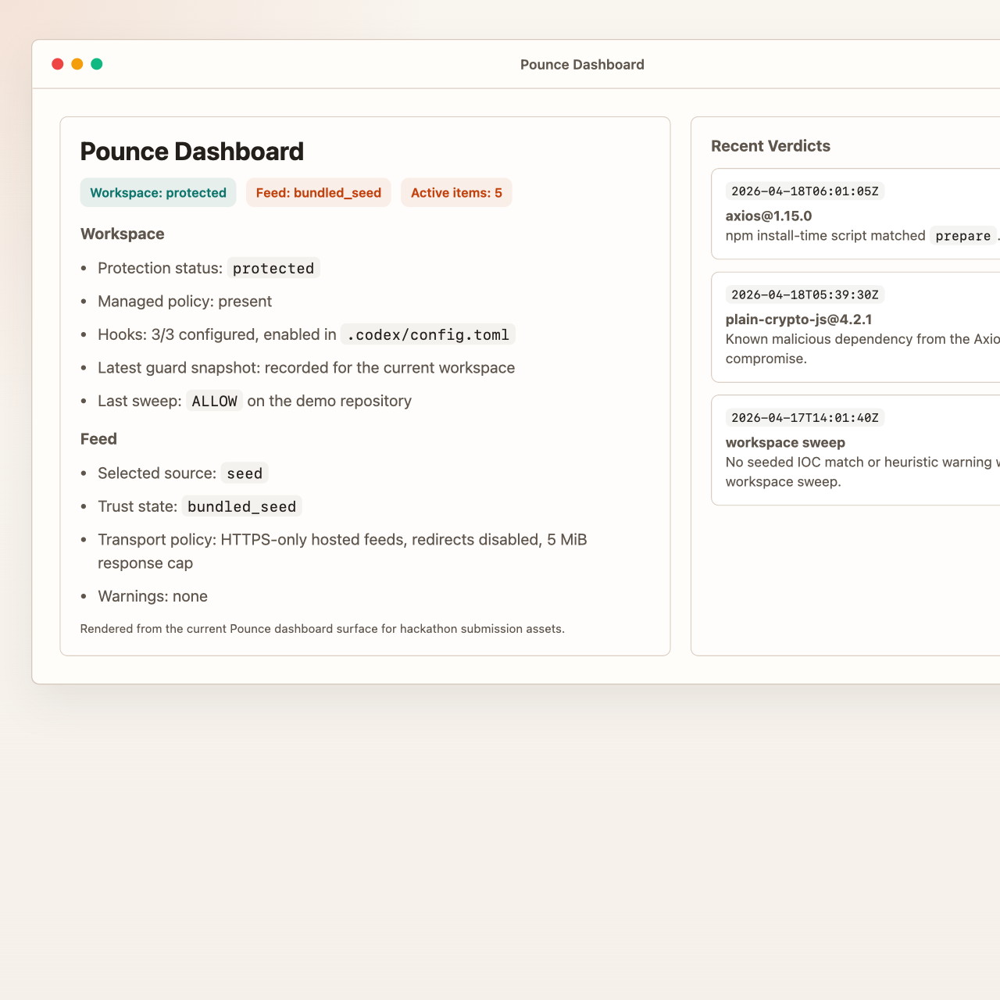

# Pounce

Pounce is a Codex-native dependency security layer that vets exact package releases, enforces shell-time install guardrails, blocks unexplained manifest edits, and surfaces trust state directly in chat.



## Quick start

```bash
python3 plugins/pounce/scripts/install_local.py --workspace "$(pwd)"
python3 plugins/pounce/scripts/pounce_demo.py
pytest -q
```

Then in Codex:

```text
Show the Pounce dashboard for this workspace
```

## What it protects

- Exact release vetting for npm and PyPI through `pounce.vet`
- Same-turn hook enforcement for risky dependency installs
- Dependency guard snapshots for manifests and lockfiles
- Workspace sweeps for malicious indicators and install-time mechanisms
- Feed trust reporting with bounded hosted-feed transport

## Security posture

- Hosted feeds are HTTPS-only, redirects are disabled, and responses are capped at 5 MiB.
- `pounce.vet` stays usable when verification is degraded, but now returns `verification_status` and `manual_review_required`.
- Hook-enforced dependency installs fail closed when verification is unavailable or the guard state is missing or corrupt.
- Package names are validated before subprocess or registry use, and the `npm view` path uses an explicit `--` separator.
- Workspace writes are confined so stamps, guard state, and installer output cannot target `/`, `$HOME`, plugin internals, or shared state directories.

## Repository layout

- `plugins/pounce/scripts/pounce_runtime.py`: release vetting, guard state, dashboard assembly, command analysis
- `plugins/pounce/scripts/pounce_intel.py`: feed normalization, sync, hosted-feed loading, source precedence
- `plugins/pounce/scripts/pounce_mcp_server.py`: MCP surface, request validation, sanitized error handling
- `plugins/pounce/scripts/pounce_hook.py`: hook enforcement entrypoint

## Verification

- `python3 plugins/pounce/scripts/pounce_demo.py --json`
- `python3 -m pytest -q`

## Docs

- [Plugin README](plugins/pounce/README.md)
- [Hackathon demo runbook](docs/hackathon-demo.md)
- [Final spec](docs/pounce-final-spec.md)
